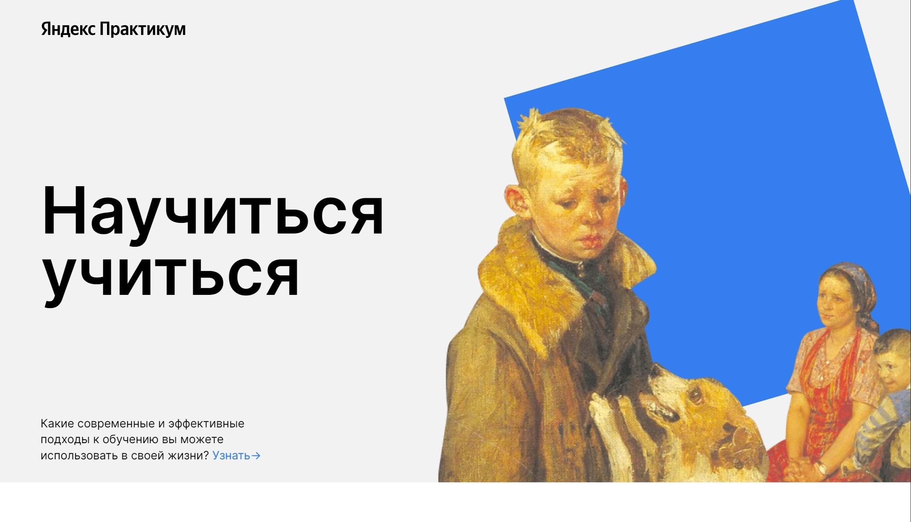

#  *Научиться учиться*

**Научиться учиться** — Проект описывающий интересные места для путишествия по России.

[Демо-страница](https://sanyazola.github.io/how-to-learn-pluss/)

## Описание

Проект описывает современные и эффективные подходы к обучению.

### 🚀 Возможности:
- Кликабельные ссылки.
- Анимация фигур.
- Добавлены видео

### Технологии и стек
- Flexbox.
- Структуры БЭМ классов.
- Добавлены фотограций через src.
- Реализована анимация и трансформация фигур.
- Размещение видео через iframe.

